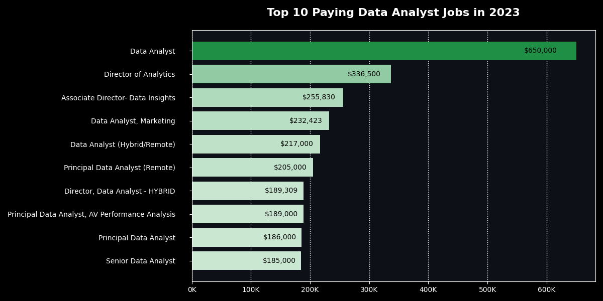
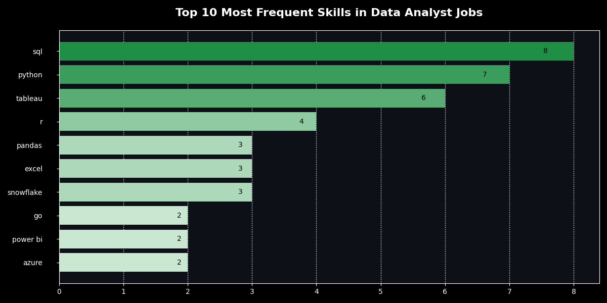

# Introduction
Let's explore the job market! This project looks into top-paying jobs, highlights in-demand skills and 📈 where high demand meets 💰 high salary in data analytics.

 Check them out my SQL queries here: [project_sql folder](/project_sql/)

# Business Task
Driven by a quest to navigate the data analyst job market more effectively, this project was born from a desire to pinpoint top-paid and in-demand skills, streamlining others work to find optimal jobs.

All data comes from the  [SQL Course](https://lukebarousse.com/sql) by [Luke Barousse](https://www.lukebarousse.com). 

### It's packed with insights on:
- Job titles
- Salaries
- Locations
- Skills

### The questions I wanted to answer through my SQL queries:

1. What are the top-paying data analyst jobs?
2. What skills are required for these top-paying jobs?
3. What skills are most in demand for data analysts?
4. Which skills are associated with higher salaries?
5. What are the most optimal skills to learn?

# Tools I Used
For my deep dive into the data analyst job market, I harnessed the power of the following key tools:

- **SQL:** Powers my analysis by querying databases for key insights.
- **PostgreSQL:** The database system managing job posting data.
- **Visual Studio Code:** My tool for managing databases and running SQL queries.
- **Git & GitHub:** Ensure version control, collaboration, and tracking for scripts and analysis.

# The Analysis
Each query for this project aimed at investigating specific aspects of the data analyst job market. Here’s how I approached each question:

### 1. What are the top-paying data analyst jobs?
I identified the highest-paying roles by filtering data analyst positions based on average yearly salary and location, with a focus on remote jobs.

The query reveals top-paying opportunities in the field.

```SQL
SELECT 
    job_id,
    job_title,
    job_schedule_type,
    job_location,
    salary_year_avg,
    job_posted_date,
    name AS "company_name"
FROM 
    job_postings_fact a
LEFT JOIN company_dim b ON a.company_id = b.company_id
WHERE job_location LIKE '%Anywhere%'
    AND salary_year_avg IS NOT NULL
    AND job_title_short LIKE '%Data Analyst%'
ORDER BY salary_year_avg DESC
LIMIT 10;
```
Here's the breakdown of the top data analyst jobs in 2023:

- **Wide Salary Range:** Top 10 paying data analyst roles span from **$184,000 to $650,000**, indicating significant salary potential in the field.

- **Diverse Employers:** Companies like SmartAsset**, Meta, and AT&T are among those offering high salaries, showing a broad interest across different industries.

- **Job Title Variety:** There's a high diversity in job titles, from Data Analyst to Director of Analytics, reflecting varied roles and specializations within data analytics.


*Bar graph visualizing the salary for the top 10 salaries for data analysts; ChatGPT generated this graph from my SQL query results*

### 2. What skills are required for these top-paying jobs?
To understand what skills are required for the top-paying jobs, I joined the job postings with the skills data, providing insights into what employers value for high-compensation roles.

```SQL
WITH top_paying_jobs AS (
    SELECT	
        job_id,
        job_title,
        salary_year_avg,
        name AS company_name
    FROM
        job_postings_fact
    LEFT JOIN company_dim ON job_postings_fact.company_id = company_dim.company_id
    WHERE
        job_title_short = 'Data Analyst' AND 
        job_location = 'Anywhere' AND 
        salary_year_avg IS NOT NULL
    ORDER BY
        salary_year_avg DESC
    LIMIT 10
)

SELECT 
    top_paying_jobs.*,
    skills
FROM top_paying_jobs
INNER JOIN skills_job_dim ON top_paying_jobs.job_id = skills_job_dim.job_id
INNER JOIN skills_dim ON skills_job_dim.skill_id = skills_dim.skill_id
ORDER BY
    salary_year_avg DESC;
```

Here's the breakdown of the most demanded skills for the top 10 highest paying data analyst jobs in 2023:

1. **SQL**
2. **Python**
3. **Tableau**

Other skills like **R**, **Snowflake**, **Pandas**, and **Excel** also show varying degrees of demand.


*Bar graph visualizing the count of skills for the top 10 paying jobs for data analysts; ChatGPT generated this graph from my SQL query results*

### 3. What skills are most in demand for data analysts?

This query helped identify the skills most frequently requested in job postings, directing focus to areas with high demand.

```SQL
SELECT 
    skills,
    COUNT(skills_job_dim.job_id) AS demand_count
FROM job_postings_fact
INNER JOIN skills_job_dim ON job_postings_fact.job_id = skills_job_dim.job_id
INNER JOIN skills_dim ON skills_job_dim.skill_id = skills_dim.skill_id
WHERE
    job_title_short = 'Data Analyst' 
    AND job_work_from_home = True 
GROUP BY
    skills
ORDER BY
    demand_count DESC
LIMIT 5;
```

Here's the breakdown of the most demanded skills for data analysts in 2023
- **SQL** and **Excel** are still key, highlighting the importance of solid skills data processing & spreadsheets.
- **Programming** and **Visualization Tools** like **Python**, **Tableau**, and **Power BI** are crucial, showing the importance technical skills in presenting and analyzing data.

| Skills   | Demand Count |
|----------|-------------:|
| SQL      | 7291         |
| Excel    | 4611         |
| Python   | 4330         |
| Tableau  | 3745         |
| Power BI | 2609         |

*Table of the demand for the top 5 skills in data analyst job postings*

### 4. Which skills are associated with higher salaries?

Exploring the average salaries associated with different skills revealed which skills are the highest paying.

```SQL
SELECT 
    skills,
    ROUND(AVG(salary_year_avg), 0) AS avg_salary
FROM job_postings_fact
INNER JOIN skills_job_dim ON job_postings_fact.job_id = skills_job_dim.job_id
INNER JOIN skills_dim ON skills_job_dim.skill_id = skills_dim.skill_id
WHERE
    job_title_short = 'Data Analyst'
    AND salary_year_avg IS NOT NULL
    AND job_work_from_home = True 
GROUP BY
    skills
ORDER BY
    avg_salary DESC
LIMIT 25;
```

Here's a breakdown of the results for top paying skills for Data Analysts:
- **High Demand for Big Data & ML Skills:** Top salaries go to analysts with expertise in big data technologies (PySpark, Couchbase), machine learning tools (DataRobot, Jupyter), and Python libraries (Pandas, NumPy), reflecting the high value placed on data processing and predictive modeling skills.

- **Software Development & Deployment Proficiency:** Skills in development and deployment tools (GitLab, Kubernetes, Airflow) highlight the lucrative overlap between data analysis and engineering, with a focus on automation and efficient data pipeline management.

- **Cloud Computing Expertise:** Knowledge of cloud and data engineering tools (Elasticsearch, Databricks, GCP) emphasizes the growing demand for cloud-based analytics, showing that cloud skills lead to higher earning potential in data analytics.

| Skills        | Average Salary ($) |
|---------------|-------------------:|
| pyspark       |            208,172 |
| bitbucket     |            189,155 |
| couchbase     |            160,515 |
| watson        |            160,515 |
| datarobot     |            155,486 |
| gitlab        |            154,500 |
| swift         |            153,750 |
| jupyter       |            152,777 |
| pandas        |            151,821 |
| elasticsearch |            145,000 |

*Table of the average salary for the top 10 paying skills for data analysts*

### 5. What are the most optimal skills to learn?

Combining insights from demand and salary data, this query aimed to pinpoint skills that are both in high demand and have high salaries, offering a strategic focus for skill development.

```sql
SELECT 
    skills_dim.skill_id,
    skills_dim.skills,
    COUNT(skills_job_dim.job_id) AS demand_count,
    ROUND(AVG(job_postings_fact.salary_year_avg), 0) AS avg_salary
FROM job_postings_fact
INNER JOIN skills_job_dim ON job_postings_fact.job_id = skills_job_dim.job_id
INNER JOIN skills_dim ON skills_job_dim.skill_id = skills_dim.skill_id
WHERE
    job_title_short = 'Data Analyst'
    AND salary_year_avg IS NOT NULL
    AND job_work_from_home = True 
GROUP BY
    skills_dim.skill_id
HAVING
    COUNT(skills_job_dim.job_id) > 10
ORDER BY
    avg_salary DESC,
    demand_count DESC
LIMIT 25;
```

| Skill ID | Skills     | Demand Count | Average Salary ($) |
|----------|------------|--------------|-------------------:|
| 8        | go         | 27           |            115,320 |
| 234      | confluence | 11           |            114,210 |
| 97       | hadoop     | 22           |            113,193 |
| 80       | snowflake  | 37           |            112,948 |
| 74       | azure      | 34           |            111,225 |
| 77       | bigquery   | 13           |            109,654 |
| 76       | aws        | 32           |            108,317 |
| 4        | java       | 17           |            106,906 |
| 194      | ssis       | 12           |            106,683 |
| 233      | jira       | 20           |            104,918 |

*Table of the most optimal skills for data analyst sorted by salary*

Here's a breakdown of the most optimal skills for Data Analysts in 2023: 

- **High-Demand Programming Languages:** Python and R lead in demand, with 236 and 148 demand counts respectively. Their average salaries are around **$101,397** for Python and **$100,499** for R, indicating that these languages are highly valued but also widely used.

- **Cloud Tools and Technologies:** Skills in technologies like Snowflake, Azure, AWS, and BigQuery show strong demand and high average salaries, highlighting the increasing importance of cloud platforms and big data tools in data analysis.

- **Business Intelligence and Visualization Tools:** Tableau (demand count of 230) and Looker (demand count of 49) have average salaries of **$99,288** and **$103,795** respectively, emphasizing the vital role of data visualization and business intelligence in transforming data into insights.

- **Database Technologies:** Expertise in traditional and NoSQL databases (e.g., Oracle, SQL Server, NoSQL) has a strong demand, with average salaries ranging from **$97,786** to **$104,534**, reflecting the need for proficient data storage and management skills.


# What I Learned

Throughout this adventure, I've turbocharged my SQL toolkit with some serious firepower:

- **🧩 Complex Query Crafting:** Mastered the art of advanced SQL, merging tables like a pro and wielding WITH clauses for ninja-level temp table maneuvers.
- **📊 Data Aggregation:** Got cozy with GROUP BY and turned aggregate functions like COUNT() and AVG() into my data-summarizing sidekicks.
- **💡 Analytical Wizardry:** Leveled up my real-world puzzle-solving skills, turning questions into actionable, insightful SQL queries.

# Conclusions

### Insights
From the analysis, several general insights emerged:

1. **Top-Paying Data Analyst Jobs:** The highest-paying remote data analyst roles have a wide salary range, with the highest reaching **$650,000**!

2. **Skills for Top-Paying Jobs:** High-paying data analyst positions require advanced proficiency in SQL, making it a critical skill for top salaries.

3. **Most In-Demand Skills:** SQL is the most demanded skill in the data analyst job market, making it essential for job seekers.

4. **Skills with Higher Salaries:** Specialized skills like SVN and Solidity are associated with the highest average salaries, reflecting the premium placed on niche expertise.

5. **Optimal Skills for Job Market Value:** **SQL** leads in both demand and salary, positioning it as one of the best skills for data analysts to learn to boost their market value.


### Closing Thoughts

This project helped improve my SQL skills and gave valuable insights into the data analyst job market. The analysis shows which skills are most important for job seekers, helping them focus on the right areas to stand out. By prioritizing high-demand, high-salary skills, aspiring data analysts can better position themselves in a competitive job market. This project emphasizes the need for continuous learning and adapting to new trends in data analytics.